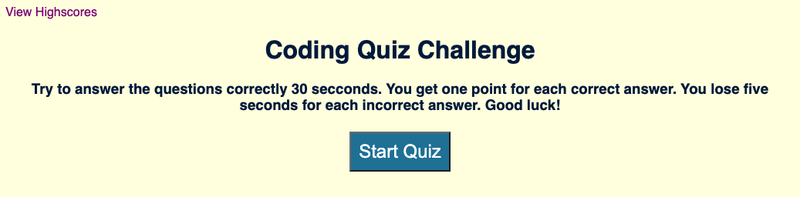
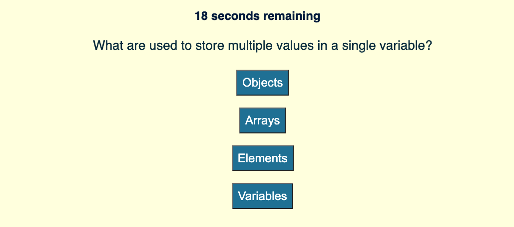
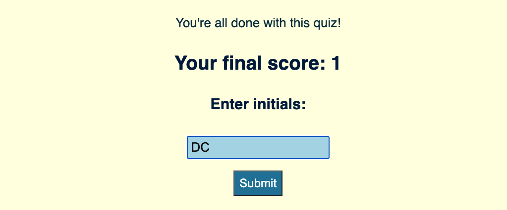

# Timed-Code-Quiz

## Description

This is a timed quiz using Javascript which contains the following fuctionality:

* The "Quiz Introduction" page contains a "Start Quiz" button that will kick off the quiz.

* A point is added for each correct answer, but five seconds is deducted from the timer for each incorrect answer.
* The game ends once all questions are answered or if the timer reaches 0.
* When the quiz is over, the final score is displayed on the "All Done" page where users must type in their initials.  

* Both initials and final score are then saved to local storage, and displayed on the "High Score" page.
* Then the user has the option to "Go Back" to the "Quiz Introduction" page, or ...
* The user has the option to "Clear Score" so that it's not kept in local storage.
* From the "Quiz Introduction" page, the user may click the "View Highscores" link on the upper left to re-visit the "High Score" page and see the last initials and score that are stored in local storage.

Here's the link to my code quiz: 

https://donnastjames.github.io/Timed-Code-Quiz/

